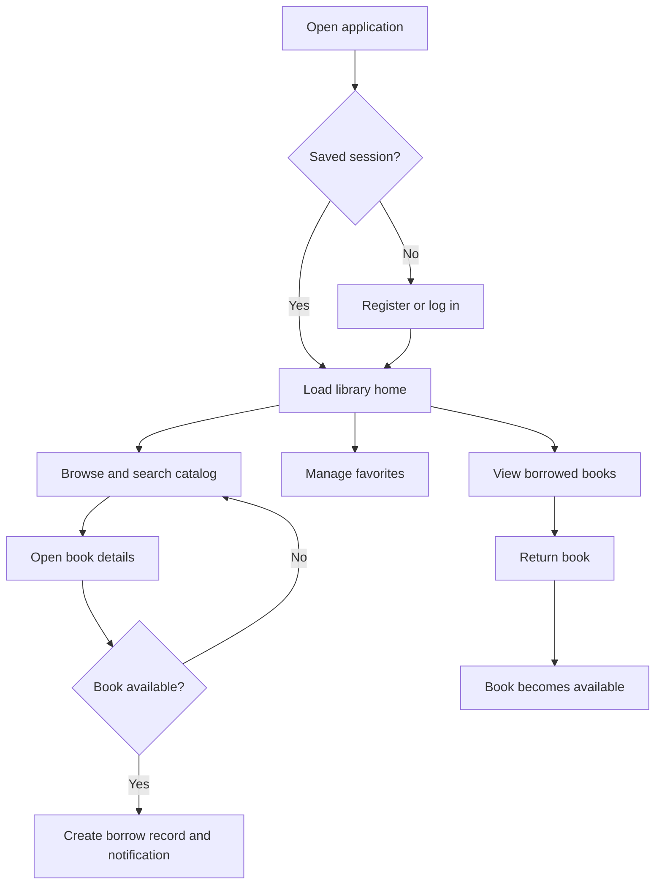
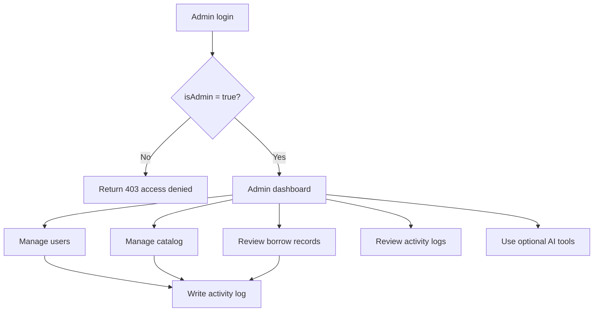

# Digital Library Management System

A full-stack digital library web application built with **React + Vite** (frontend) and **Node.js + Express + MongoDB** (backend).

## How the Application Works

1. Vite serves the React client during development and builds static assets for production.
2. The client calls the Express API under `/api` and sends the current user ID in the `x-user-id` header.
3. Express validates request data, applies member or admin authorization, and executes Mongoose queries.
4. MongoDB stores users, books, borrow records, favorites, notifications, and admin activity logs.
5. Borrowing changes a book from `Available` to `Borrowed` and creates a 14-day borrow record.
6. Returning a book changes the record to `Returned` and restores the book to `Available`.
7. The admin dashboard calculates live totals and circulation aggregates from MongoDB.
8. AI features call Gemini only from the server, so the API key is never sent to the browser.

## User and Admin Flows

### Application workflow



### Admin workflow



## API Reference

The base URL is `http://localhost:5000/api` in local development. Protected member endpoints expect `x-user-id`; admin endpoints additionally require that the referenced user has `isAdmin: true`.

### Authentication

| Method | Endpoint | Access | Description |
| --- | --- | --- | --- |
| POST | `/auth/register` | Public | Create a member account |
| POST | `/auth/login` | Public | Authenticate a member or administrator |
| GET | `/auth/me` | Member | Restore the current user |
| POST | `/auth/send-otp` | Public | Generate an OTP for password reset |
| POST | `/auth/verify-otp` | Public | Verify a password-reset OTP |
| POST | `/auth/reset-password` | Public | Set a new password |
| PUT | `/auth/profile` | Member | Update editable profile fields |

### Member operations

| Method | Endpoint | Description |
| --- | --- | --- |
| GET | `/books` | List books sorted by numeric book ID |
| GET | `/books/:id` | Get a book by MongoDB ID or numeric book ID |
| POST | `/books/:id/borrow` | Borrow an available book for 14 days |
| GET | `/my-books` | List the current member's borrow records |
| PUT | `/my-books/:id/return` | Return one of the member's books |
| GET | `/favorites` | List the member's favorite books |
| POST | `/books/:id/favorite` | Add a book to favorites |
| DELETE | `/books/:id/favorite` | Remove a book from favorites |
| GET | `/notifications` | List the latest notifications |
| PUT | `/notifications/:id/read` | Mark one notification as read |
| PUT | `/notifications/read-all` | Mark all notifications as read |

### AI operations

| Method | Endpoint | Description |
| --- | --- | --- |
| POST | `/admin/ai/generate-description` | Generate a book description |
| POST | `/admin/ai/recommend-category` | Suggest a catalog category |
| POST | `/admin/ai/chat` | Ask the library admin assistant a question |
| GET | `/admin/ai/insights` | Generate a library health summary |

## Authentication and Security

Current safeguards include:

- `.env`, `.env.*`, and local dependency/build directories are excluded by Git ignore rules.
- Password hashes, rather than plaintext passwords, are stored in MongoDB.
- Serialized user responses omit `passwordHash`.
- Admin endpoints use a dedicated `requireAdmin` middleware.
- Users cannot delete their own admin account through the admin API.
- User and book deletion cleans up related borrow, favorite, and notification data where applicable.
- The Gemini key is read server-side and is never exposed in client code.
- Request body limits reduce the risk of unexpectedly large JSON or form payloads.

Before production deployment, address these hardening items:

- Replace the current SHA-256 password hashing with a slow password KDF such as Argon2id or bcrypt.
- Replace the client-controlled `x-user-id` session approach with signed, expiring HTTP-only cookies or short-lived JWT access tokens with refresh-token rotation.
- Remove hard-coded development admin credentials and provision the first administrator through a secure migration or deployment secret.
- Add rate limiting, stricter CORS origins, request validation, HTTPS, CSRF protection where cookie auth is used, and centralized error monitoring.
- Keep MongoDB credentials and the Gemini key in the deployment provider's secret manager.
- Never upload `.env`, database dumps, private keys, or service-account files.

## Testing and Quality Checks

Run the available checks from the repository root:

```bash
npm run build
npm run lint
```

The build verifies that the React production bundle can be generated. The linter checks JavaScript and JSX for common problems. An integration test suite and API contract tests are recommended future additions.

## Deployment

The application can be deployed as separate frontend and API services or behind one reverse proxy.
### Frontend deployment

1. Import the repository into Vercel with the project root as the root directory.
2. Use `npm run build` as the build command and `dist` as the output directory. The included `vercel.json` configures this automatically.
3. Add `VITE_API_URL=https://<render-service>.onrender.com/api` in Vercel environment variables for Production, Preview, and Development as needed.
4. Redeploy after setting the variable. Then replace Render's `CORS_ORIGIN` with the final Vercel domain and redeploy the API.
5. For custom domains, include the exact `https://` origin in `CORS_ORIGIN`; separate multiple origins with commas.

## Screenshots

The repository currently includes the application UI assets but does not yet contain a committed screenshot gallery. For a GitHub presentation, capture these views after starting the app and place optimized images in `docs/screenshots/`:

| Screenshot | Suggested filename | What it should show |
| --- | --- | --- |
| Library home | `library-home.png` | Catalog hero, search, categories, and featured books |
| Book details | `book-details.png` | Metadata, availability, borrow, and favorite actions |
| My books | `my-books.png` | Active borrow records, due dates, and return action |
| Admin dashboard | `admin-dashboard.png` | Summary cards, circulation metrics, and charts |
| Admin catalog | `admin-books.png` | Book management table and create/edit form |

Embed them in this section once captured:

```markdown


```

## Future Enhancements

- Migrate authentication to secure cookie-based sessions with refresh-token rotation.
- Use Argon2id or bcrypt with password policy and account lockout controls.
- Add automated unit, integration, and end-to-end tests.
- Add book search indexing, server-side filtering, and richer pagination.
- Add reservation queues and automatic due-date reminders.
- Add email delivery for OTPs, receipts, and overdue notices.
- Add Docker and Docker Compose configurations for repeatable local setup.
- Add CI workflows for linting, builds, dependency auditing, and deployment.
- Add image upload storage with validation and content scanning.
- Add fine-grained roles such as librarian, catalog editor, and reporting-only administrator.
- Add accessibility audits, keyboard navigation tests, and internationalization.
- Add observability with structured logs, health checks, metrics, and alerting.

## Contributing

1. Create a feature branch.
2. Keep secrets in local environment files and never commit them.
3. Run `npm run build` and `npm run lint` before opening a pull request.
4. Explain API, schema, or workflow changes in the pull request description.

## License

No license file is currently included. Add a license before accepting external contributions or distributing the project.
