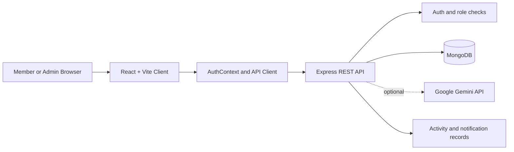
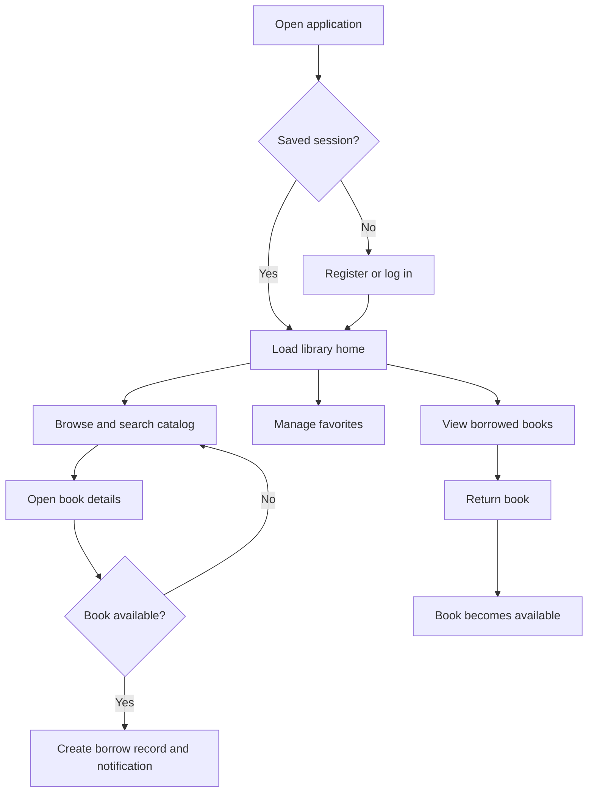
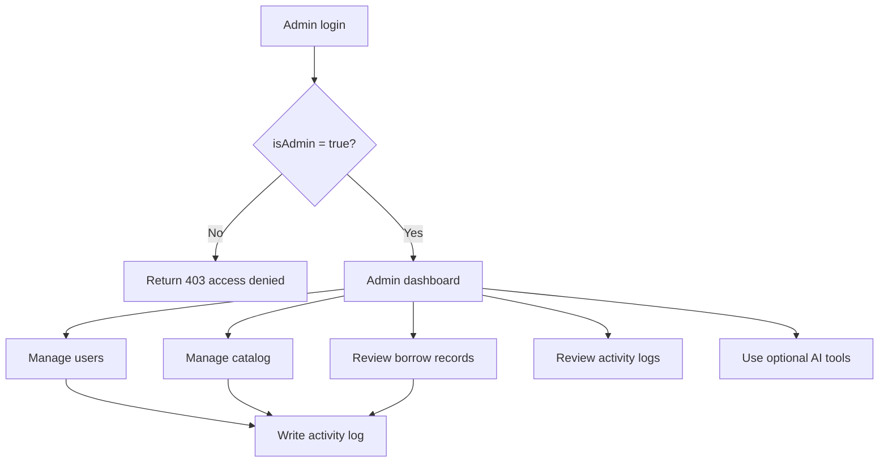
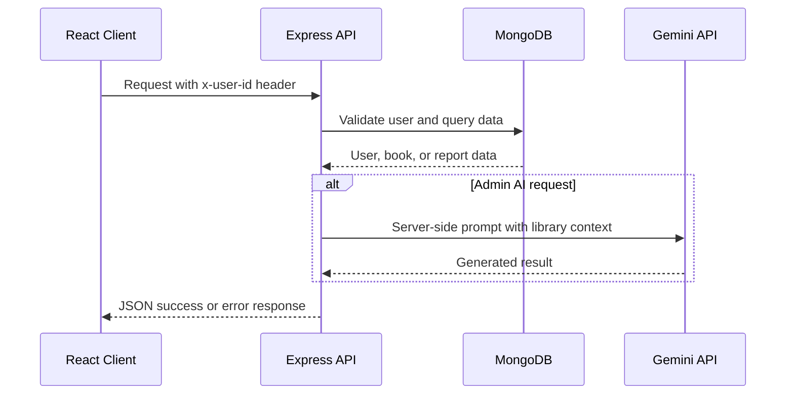
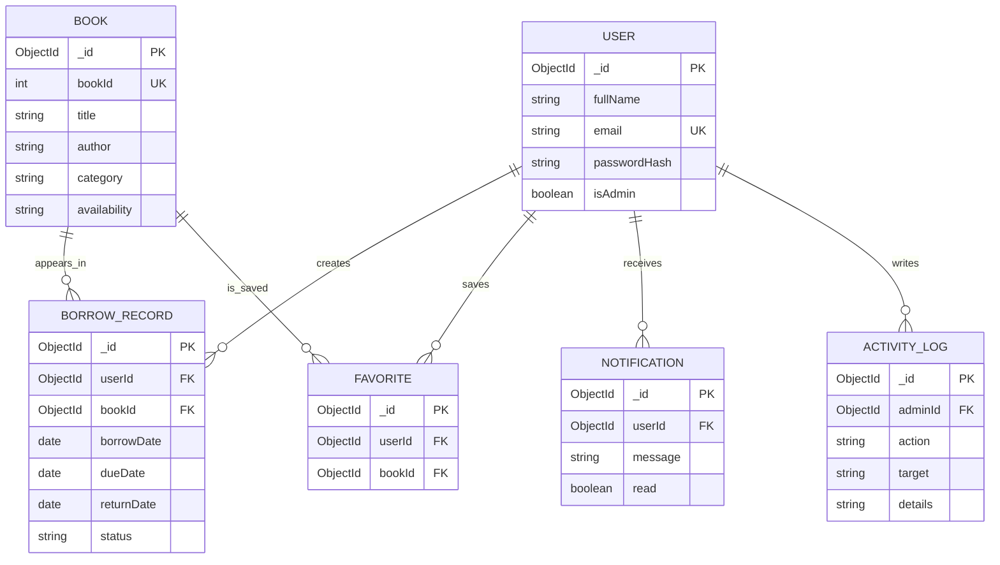

# Digital Library Management System

A full-stack digital library web application built with **React + Vite** (frontend) and **Node.js + Express + MongoDB** (backend).

---

## 📁 Project Structure

```
Digital Library Management System/
├── frontend/                   ← React + Vite frontend
│   ├── index.html
│   ├── vite.config.js
# Digital Library Management System

A full-stack digital library platform for browsing, borrowing, returning, and saving books. The application also provides an administrator workspace for catalog management, user management, circulation reporting, audit activity, and optional AI-assisted catalog operations.

This project is designed as a practical portfolio and interview project demonstrating a React client, an Express REST API, MongoDB persistence, role-based workflows, and a responsive CSS interface.

## Contents

- [Overview](#overview)
- [Features](#features)
- [Technology Stack](#technology-stack)
- [System Requirements](#system-requirements)
- [Getting Started](#getting-started)
- [Project Structure](#project-structure)
- [How the Application Works](#how-the-application-works)
- [User and Admin Flows](#user-and-admin-flows)
- [API Reference](#api-reference)
- [Database Design](#database-design)
- [Authentication and Security](#authentication-and-security)
- [Testing and Quality Checks](#testing-and-quality-checks)
- [Deployment](#deployment)
- [Screenshots](#screenshots)
- [Future Enhancements](#future-enhancements)

## Overview

The system has two user experiences:

| Experience | Capabilities |
| --- | --- |
| Library member | Register, log in, browse books, view book details, borrow available books, return books, manage favorites, edit profile, and read notifications |
| Administrator | View dashboard metrics, manage users and books, review borrow records, mark books returned, inspect activity logs, and use optional Gemini-powered catalog tools |

The primary runnable application is the root `src/` + `server.js` pair. The `frontend/` and `backend/` directories contain a separate frontend/backend arrangement that is useful as a reference or alternate development surface; the root scripts are the recommended entry point for the complete feature set.

## Features

### Member features

- Email and password registration and login
- Password reset with email and OTP endpoints
- Session restoration using `sessionStorage`
- Book catalog with availability, category, rating, author, year, ISBN, cover, and description
- Book lookup by MongoDB ID or numeric `bookId`
- Borrowing with a 14-day due date
- Return workflow that makes the book available again
- Personal borrowed-book history
- Add/remove favorites
- Notifications for borrowing, returns, and favorites
- Profile editing, including academic and contact information

### Administrator features

- Dashboard statistics for books, users, borrows, active borrows, and overdue books
- Category distribution, monthly circulation, and top-borrowed-book reporting
- Paginated and searchable user management
- User creation, editing, deletion, and admin-role management
- Book creation, editing, deletion, and automatic numeric ID assignment
- Borrow-record filtering and administrative returns
- Activity log for administrative actions
- AI-generated descriptions, category recommendations, chat, and library insights when Gemini is configured

## Technology Stack

| Layer | Technology | Purpose |
| --- | --- | --- |
| Client | React 19 | Component-based user interface |
| Client build | Vite 8 | Development server and production bundling |
| Routing | React Router 7 | Member and admin navigation |
| Icons | Lucide React | Interface iconography |
| Styling | CSS | Responsive application styling |
| API | Node.js and Express 4 | REST endpoints and business logic |
| Database | MongoDB and Mongoose 8 | Document storage, validation, and queries |
| Configuration | dotenv | Local and deployment environment variables |
| Optional AI | Google Gemini 2.0 Flash API | Admin catalog assistance and insights |
| Quality | oxlint | JavaScript and JSX linting |

## System Requirements

- Node.js 20 or newer recommended
- npm 10 or newer recommended
- MongoDB 6 or newer, either local or hosted through MongoDB Atlas
- A modern browser with JavaScript enabled
- Optional: a Google AI Studio Gemini API key for admin AI tools

Check installed versions:

```bash
node --version
npm --version
```

## Getting Started

### 1. Clone and install

```bash
git clone https://github.com/pbhadrashette/Digital-Library-Management-System.git
cd Digital-Library-Management-System
npm install
```

### 2. Configure the backend

Create a local `.env` file from the safe template. Do not commit `.env` files.

```bash
copy .env.example .env
```

On macOS/Linux, use `cp .env.example .env` instead. Set values appropriate for your machine:

```dotenv
MONGODB_URI=mongodb://127.0.0.1:27017/lumen_library
PORT=5000
GEMINI_API_KEY=your_gemini_api_key_here
```

`GEMINI_API_KEY` is optional. The core library features work without it; AI endpoints return a service-unavailable response when it is not configured.

### 3. Start the application

Run the API and Vite development server together:

```bash
npm run dev:all
```

Or use separate terminals:

```bash
npm run server
npm run dev
```

The API runs at `http://localhost:5000` and Vite normally runs at the URL printed by Vite, usually `http://localhost:5173`.

The API seeds the catalog with sample books when the database is empty. It also creates or synchronizes the development admin account configured in `server.js`; change that behavior and use a deployment secret before production use.

### 4. Build for production

```bash
npm run build
npm run preview
```

## Project Structure

```text
Digital Library Management System/
├── src/                         # Primary React application
│   ├── App.jsx                  # Member-facing routes and views
│   ├── App.css                  # Main application styles
│   ├── main.jsx                 # React entry point
│   ├── admin/                   # Admin shell and admin pages
│   │   ├── AdminApp.jsx
│   │   └── pages/
│   ├── context/AuthContext.jsx  # Authentication state and actions
│   └── services/api-backend.js  # Primary API client and local session helpers
├── server.js                    # Primary Express API, schemas, seed data, and routes
├── public/                      # Primary static assets
├── frontend/                    # Alternate standalone Vite frontend
├── backend/                     # Alternate minimal Express backend
├── api.js                       # Additional API/server implementation kept in the project
├── .env.example                 # Safe environment-variable template
├── package.json                 # Root scripts and dependencies
├── package-lock.json            # Reproducible root dependency lockfile
└── vite.config.js               # Root Vite configuration
```

## System Architecture



## How the Application Works

1. Vite serves the React client during development and builds static assets for production.
2. The client calls the Express API under `/api` and sends the current user ID in the `x-user-id` header.
3. Express validates request data, applies member or admin authorization, and executes Mongoose queries.
4. MongoDB stores users, books, borrow records, favorites, notifications, and admin activity logs.
5. Borrowing changes a book from `Available` to `Borrowed` and creates a 14-day borrow record.
6. Returning a book changes the record to `Returned` and restores the book to `Available`.
7. The admin dashboard calculates live totals and circulation aggregates from MongoDB.
8. AI features call Gemini only from the server, so the API key is never sent to the browser.

## User and Admin Flows

### Application workflow



### Admin workflow



## API Reference

The base URL is `http://localhost:5000/api` in local development. Protected member endpoints expect `x-user-id`; admin endpoints additionally require that the referenced user has `isAdmin: true`.

### Authentication

| Method | Endpoint | Access | Description |
| --- | --- | --- | --- |
| POST | `/auth/register` | Public | Create a member account |
| POST | `/auth/login` | Public | Authenticate a member or administrator |
| GET | `/auth/me` | Member | Restore the current user |
| POST | `/auth/send-otp` | Public | Generate an OTP for password reset |
| POST | `/auth/verify-otp` | Public | Verify a password-reset OTP |
| POST | `/auth/reset-password` | Public | Set a new password |
| PUT | `/auth/profile` | Member | Update editable profile fields |

### Member operations

| Method | Endpoint | Description |
| --- | --- | --- |
| GET | `/books` | List books sorted by numeric book ID |
| GET | `/books/:id` | Get a book by MongoDB ID or numeric book ID |
| POST | `/books/:id/borrow` | Borrow an available book for 14 days |
| GET | `/my-books` | List the current member's borrow records |
| PUT | `/my-books/:id/return` | Return one of the member's books |
| GET | `/favorites` | List the member's favorite books |
| POST | `/books/:id/favorite` | Add a book to favorites |
| DELETE | `/books/:id/favorite` | Remove a book from favorites |
| GET | `/notifications` | List the latest notifications |
| PUT | `/notifications/:id/read` | Mark one notification as read |
| PUT | `/notifications/read-all` | Mark all notifications as read |

### Admin operations

| Method | Endpoint | Description |
| --- | --- | --- |
| GET | `/admin/stats` | Dashboard totals and circulation aggregates |
| GET | `/admin/users` | Search and paginate users |
| POST | `/admin/users` | Create a user |
| PUT | `/admin/users/:id` | Update a user or password |
| DELETE | `/admin/users/:id` | Delete a user and related records |
| POST | `/admin/books` | Create a catalog entry |
| PUT | `/admin/books/:id` | Update a catalog entry |
| DELETE | `/admin/books/:id` | Delete a catalog entry and related records |
| GET | `/admin/borrow-records` | Search and paginate circulation records |
| PUT | `/admin/borrow-records/:id/return` | Mark a borrow as returned |
| GET | `/admin/activity-logs` | Read administrator activity history |

### AI operations

| Method | Endpoint | Description |
| --- | --- | --- |
| POST | `/admin/ai/generate-description` | Generate a book description |
| POST | `/admin/ai/recommend-category` | Suggest a catalog category |
| POST | `/admin/ai/chat` | Ask the library admin assistant a question |
| GET | `/admin/ai/insights` | Generate a library health summary |

### API flow



## Database Design

### Collections

| Collection | Important fields | Relationships |
| --- | --- | --- |
| `users` | `fullName`, `email`, `passwordHash`, profile fields, `isAdmin` | Referenced by borrows, favorites, notifications, and activity logs |
| `books` | `bookId`, `title`, `author`, `category`, `availability`, metadata | Referenced by borrows and favorites |
| `borrowrecords` | `userId`, `bookId`, `borrowDate`, `dueDate`, `returnDate`, `status` | References one user and one book |
| `favorites` | `userId`, `bookId` | Unique compound index prevents duplicate favorites |
| `notifications` | `userId`, `message`, `type`, `read` | Belongs to one user |
| `activitylogs` | `adminId`, `adminName`, `action`, `target`, `details` | Records administrator actions |

### Entity relationship diagram



## Authentication and Security

Current safeguards include:

- `.env`, `.env.*`, and local dependency/build directories are excluded by Git ignore rules.
- Password hashes, rather than plaintext passwords, are stored in MongoDB.
- Serialized user responses omit `passwordHash`.
- Admin endpoints use a dedicated `requireAdmin` middleware.
- Users cannot delete their own admin account through the admin API.
- User and book deletion cleans up related borrow, favorite, and notification data where applicable.
- The Gemini key is read server-side and is never exposed in client code.
- Request body limits reduce the risk of unexpectedly large JSON or form payloads.

Before production deployment, address these hardening items:

- Replace the current SHA-256 password hashing with a slow password KDF such as Argon2id or bcrypt.
- Replace the client-controlled `x-user-id` session approach with signed, expiring HTTP-only cookies or short-lived JWT access tokens with refresh-token rotation.
- Remove hard-coded development admin credentials and provision the first administrator through a secure migration or deployment secret.
- Add rate limiting, stricter CORS origins, request validation, HTTPS, CSRF protection where cookie auth is used, and centralized error monitoring.
- Keep MongoDB credentials and the Gemini key in the deployment provider's secret manager.
- Never upload `.env`, database dumps, private keys, or service-account files.

## Testing and Quality Checks

Run the available checks from the repository root:

```bash
npm run build
npm run lint
```

The build verifies that the React production bundle can be generated. The linter checks JavaScript and JSX for common problems. An integration test suite and API contract tests are recommended future additions.

## Deployment

The application can be deployed as separate frontend and API services or behind one reverse proxy.

### API deployment

1. Provision a Node.js service from the repository.
2. Set the start command to `npm run server`.
3. Configure `MONGODB_URI` with a private MongoDB Atlas connection string.
4. Configure `PORT` from the provider's injected port, if required.
5. Add `GEMINI_API_KEY` only when AI features are enabled.
6. Restrict CORS to the deployed frontend origin and enable HTTPS.

### Frontend deployment

1. Provision a static Node/Vite site.
2. Install dependencies with `npm install`.
3. Build with `npm run build`.
4. Serve the generated `dist/` directory.
5. Configure the production API base URL in the client service before building, or route `/api` through the same domain using a reverse proxy.
6. Configure SPA fallback to serve `index.html` for client-side routes.

### Deployment checklist

- [ ] Production MongoDB database and least-privilege database user configured
- [ ] Secrets stored in provider environment settings, never in Git
- [ ] Development admin seed credentials removed or replaced
- [ ] Production CORS and API URL configured
- [ ] HTTPS enabled
- [ ] Logs and health monitoring configured
- [ ] `npm run build` and `npm run lint` pass in CI

## Screenshots

The repository currently includes the application UI assets but does not yet contain a committed screenshot gallery. For a GitHub presentation, capture these views after starting the app and place optimized images in `docs/screenshots/`:

| Screenshot | Suggested filename | What it should show |
| --- | --- | --- |
| Library home | `library-home.png` | Catalog hero, search, categories, and featured books |
| Book details | `book-details.png` | Metadata, availability, borrow, and favorite actions |
| My books | `my-books.png` | Active borrow records, due dates, and return action |
| Admin dashboard | `admin-dashboard.png` | Summary cards, circulation metrics, and charts |
| Admin catalog | `admin-books.png` | Book management table and create/edit form |

Embed them in this section once captured:

```markdown


```

## Future Enhancements

- Migrate authentication to secure cookie-based sessions with refresh-token rotation.
- Use Argon2id or bcrypt with password policy and account lockout controls.
- Add automated unit, integration, and end-to-end tests.
- Add book search indexing, server-side filtering, and richer pagination.
- Add reservation queues and automatic due-date reminders.
- Add email delivery for OTPs, receipts, and overdue notices.
- Add Docker and Docker Compose configurations for repeatable local setup.
- Add CI workflows for linting, builds, dependency auditing, and deployment.
- Add image upload storage with validation and content scanning.
- Add fine-grained roles such as librarian, catalog editor, and reporting-only administrator.
- Add accessibility audits, keyboard navigation tests, and internationalization.
- Add observability with structured logs, health checks, metrics, and alerting.

## Contributing

1. Create a feature branch.
2. Keep secrets in local environment files and never commit them.
3. Run `npm run build` and `npm run lint` before opening a pull request.
4. Explain API, schema, or workflow changes in the pull request description.

## License

No license file is currently included. Add a license before accepting external contributions or distributing the project.
